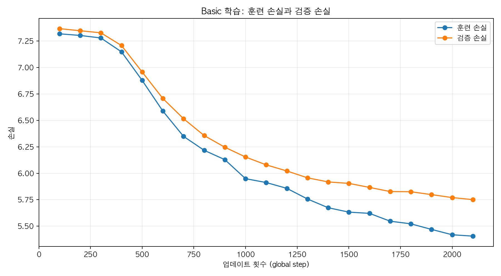
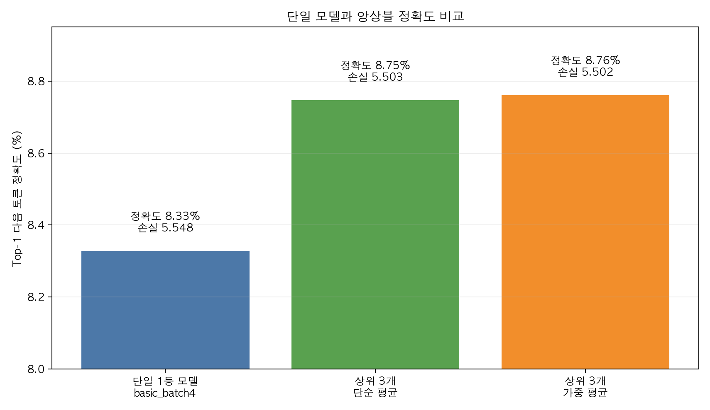
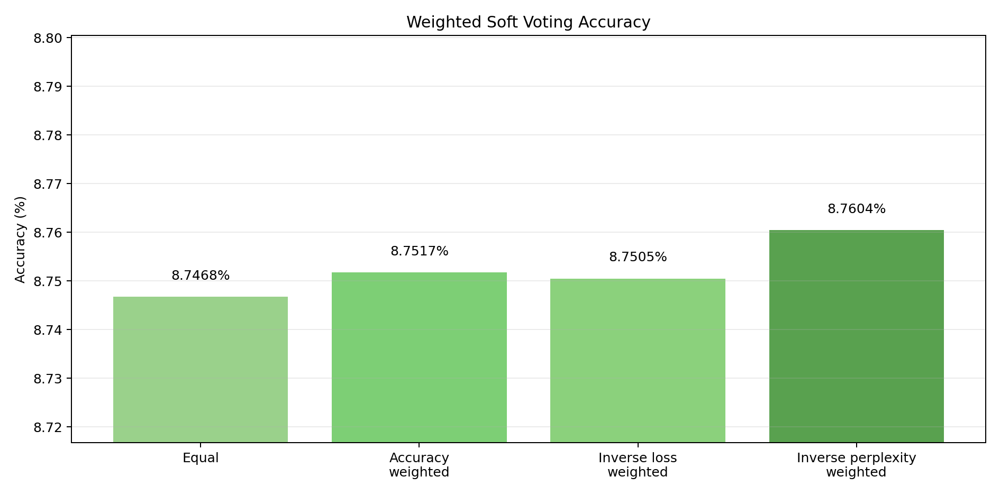
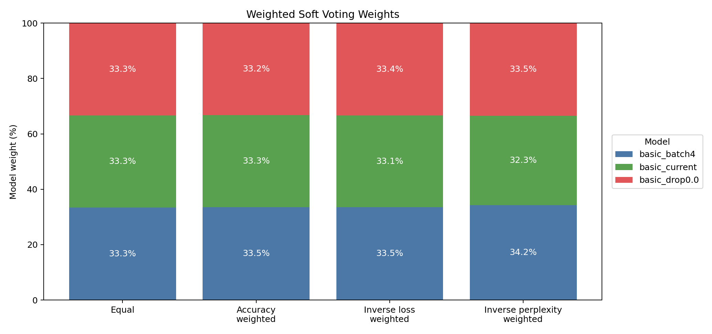

# Mini GPT Basic 구현 보고서

## 0. 반·팀원

| 항목 | 내용                           |
| ---- | ------------------------------ |
| 반   | 303                            |
| 팀명 | 2팀                            |
| 팀원 | 이호준, 조현호, 전우현, 임가인 |

## 1. 구현 현황

이번 과제에서는 GPT 방식의 next-token prediction 모델을 직접 구성했다. 전체 흐름은 `BPE tokenizer -> dataset/dataloader -> embedding -> attention/transformer -> GPT model -> train/generate -> finetune` 순서다.

| TODO          | 구현 내용                                                 | 구현 파일           | 비고                           |
| ------------- | --------------------------------------------------------- | ------------------- | ------------------------------ |
| BPE tokenizer | UTF-8 byte-level BPE, 특수 토큰, encode/decode, save/load | `src/bpe.py`        | 텍스트를 token id로 변환       |
| Dataset       | next-token input/target 생성, dataloader 구성             | `src/dataset.py`    | `input_ids`, `target_ids` 생성 |
| Embedding     | token embedding + position embedding                      | `src/embeddings.py` | token id를 벡터로 변환         |
| Attention     | multi-head causal self-attention                          | `src/attention.py`  | 미래 토큰 참조 방지            |
| Model         | LayerNorm, GELU, FeedForward, TransformerBlock, GPTModel  | `src/model.py`      | GPT 본체                       |
| Train         | batch loss, loader loss, checkpoint, generate, train loop | `src/train.py`      | 사전 학습 실행                 |
| Finetune      | 감성 분류 dataset, classifier head, train/eval            | `src/finetune.py`   | 분류용 head 추가               |

담당자:

| 담당자 | 담당 내용 |
| ------ | --------- |
|        |           |

## 2. 테스트 통과 현황

실행 명령:

```bash
/Users/hmm/miniforge3/envs/mini-gpt/bin/python -m pytest tests/ -v
```

실행 결과:

```text
28 passed, 1 warning in 8.88s
```

| 테스트 영역                                | 결과 |
| ------------------------------------------ | ---- |
| BPE tokenizer                              | 통과 |
| dataset / dataloader / embedding           | 통과 |
| attention                                  | 통과 |
| model / transformer / generate_text_simple | 통과 |
| train loss / checkpoint / generate / plot  | 통과 |
| finetune dataset / classifier / train/eval | 통과 |

warning은 `plt.show()`가 GUI 없는 환경에서 호출되어 발생한 것으로, 구현 실패는 아니다.

## 3. 데이터

사용 데이터는 NSMC 영화 리뷰 데이터다. Basic 사전 학습에서는 리뷰 문장을 하나의 corpus로 보고, 다음 토큰을 맞히는 방식으로 학습했다.

| 항목                      | 내용                              |
| ------------------------- | --------------------------------- |
| 원본 데이터               | NSMC                              |
| 원본 train 파일           | `data/ratings_train.txt`          |
| 원본 test 파일            | `data/ratings_test.txt`           |
| 사전 학습 train 파일      | `data/nsmc_lm_train.txt`          |
| 사전 학습 validation 파일 | `data/nsmc_lm_val.txt`            |
| 미세 조정 train 파일      | `data/nsmc_sentiment_train.jsonl` |
| 미세 조정 validation 파일 | `data/nsmc_sentiment_val.jsonl`   |
| 미세 조정 test 파일       | `data/nsmc_sentiment_test.jsonl`  |

Basic run에서 실제 사용한 데이터 크기:

| 항목                        |                         값 |
| --------------------------- | -------------------------: |
| corpus characters           |                  1,379,486 |
| BPE encode 후 전체 token 수 |                    805,021 |
| train token 수              |                    724,518 |
| validation token 수         |                     80,503 |
| split                       | train 90% / validation 10% |

## 4. BPE

BPE는 텍스트를 모델이 처리할 수 있는 token id로 바꾸는 단계다. 이번 구현은 UTF-8 byte-level BPE 방식이라, 한국어도 byte 단위에서 시작해 자주 등장하는 byte pair를 합치며 vocabulary를 만든다.

| 항목               | 내용                                              |
| ------------------ | ------------------------------------------------- |
| 구현 파일          | `src/bpe.py`                                      |
| 방식               | UTF-8 byte-level BPE                              |
| vocab_size         | 3000                                              |
| 학습 corpus 크기   | 1,379,486 characters                              |
| BPE 학습 시간      | 466.7초                                           |
| vocab 저장 경로    | `artifacts/final_basic/bpe_vocab_3000_basic.json` |
| 특수 토큰          | `<pad>=0`, `<unk>=1`, `<bos>=2`, `<eos>=3`        |
| byte token ID 범위 | 4~259                                             |

주의할 점은 BPE 학습 시간이 생각보다 길었다는 것이다. 이번 구현은 merge마다 pair 빈도를 다시 세는 단순 구현이기 때문에, `vocab_size=3000`에서 BPE 학습이 병목이 되었다. 그래서 학습한 vocabulary는 JSON으로 저장하고 재사용했다.

## 5. 모델 구조

Basic GPT 모델은 token id를 embedding으로 바꾼 뒤, 여러 개의 TransformerBlock을 통과시키고, 마지막에 vocabulary 전체에 대한 logit을 출력한다.

전체 구조:

```text
Input token ids
-> TokenEmbedding + PositionEmbedding
-> 4 x TransformerBlock
-> final LayerNorm
-> LM Head
-> vocab_size 개수의 next-token logits
```

Basic run 모델 설정:

| 항목           |        값 |
| -------------- | --------: |
| vocab_size     |      3000 |
| context_length |       128 |
| emb_dim        |       192 |
| n_heads        |         4 |
| n_layers       |         4 |
| drop_rate      |       0.1 |
| qkv_bias       |     False |
| 총 파라미터 수 | 2,954,112 |

TransformerBlock 내부 구조:

```text
x = x + Dropout(MultiHeadAttention(LayerNorm(x)))
x = x + FeedForward(LayerNorm(x))
```

여기서 shortcut connection을 사용해 깊은 모델에서도 입력 정보와 gradient가 더 잘 흐르도록 했다.

## 6. 사전 학습

Basic 사전 학습의 목적은 현재 context를 보고 다음 token을 예측하는 것이다. 모델은 `input_ids`를 받아 각 위치마다 다음 token 후보 점수인 logits를 출력하고, target token과 cross entropy loss를 계산한다.

### 6.1 Basic 학습 설정

| 항목          |                                                      값 |
| ------------- | ------------------------------------------------------: |
| batch_size    |                                                       8 |
| learning_rate |                                                    5e-4 |
| num_epochs    |                                                       3 |
| eval_freq     |                                                     100 |
| eval_iter     |                                                       5 |
| patience      |                                                       3 |
| global_steps  |                                                    2124 |
| best_step     |                                                    2100 |
| checkpoint    | `artifacts/final_basic/checkpoints/final_basic_best.pt` |
| train time    |                                                 107.6초 |

### 6.2 Basic 학습 결과

| 지표                           |    값 |
| ------------------------------ | ----: |
| best eval-iter train loss      | 5.406 |
| best eval-iter validation loss | 5.751 |
| full validation loss           | 5.606 |
| perplexity                     | 272.1 |
| top-1 next-token accuracy      | 8.29% |

vocab size가 3000이므로 무작위로 다음 token을 고르는 경우의 이론적 기준은 다음과 같다.

```text
random loss ~= log(3000) ~= 8.006
random top-1 accuracy ~= 1 / 3000 ~= 0.033%
```

Basic 모델은 학습이 진행될수록 train loss와 validation loss가 함께 감소했다.
따라서 모델이 NSMC 리뷰 데이터의 다음 토큰 패턴을 학습하고 있음을 확인할 수 있었다.

### 6.3 Train / Validation Loss Curve



그래프 해석:

| 관찰                                  | 의미                                                      |
| ------------------------------------- | --------------------------------------------------------- |
| train loss가 계속 감소                | 모델이 학습 데이터를 점점 잘 맞히고 있음                  |
| validation loss도 함께 감소           | 학습 데이터만 외우는 것이 아니라 검증 데이터에서도 개선됨 |
| train loss가 validation loss보다 낮음 | 학습 데이터에 더 잘 맞는 자연스러운 차이                  |

그래프의 x축인 `global step`은 모델 파라미터가 업데이트된 횟수다. loss는 매 100 step마다 측정했다. 두 선 사이의 간격은 조금씩 커졌지만 validation loss도 계속 감소했으므로, Basic 3 epoch 기준에서는 학습이 진행되고 있다고 판단했다.

### 6.4 Checkpoint

가장 좋은 validation loss를 기록한 시점의 모델을 checkpoint로 저장했다.

| 항목            | 값                                                      |
| --------------- | ------------------------------------------------------- |
| best checkpoint | `artifacts/final_basic/checkpoints/final_basic_best.pt` |
| best step       | 2100                                                    |
| 저장 내용       | model state, optimizer state, global step, config       |

checkpoint를 저장하는 이유는 마지막 epoch의 모델이 항상 가장 좋은 모델이라고 보장할 수 없기 때문이다. validation loss가 가장 낮은 시점의 모델을 저장하면, 이후 실험이나 생성에서 가장 안정적인 모델을 다시 불러올 수 있다.

### 6.5 샘플 생성 결과

같은 prompt `"영화"`를 넣고 세 가지 생성 방식을 비교했다.

| 생성 방식             | 설정                            | 샘플 특징                                        |
| --------------------- | ------------------------------- | ------------------------------------------------ |
| greedy                | `temperature=0.0`, `top_k=None` | 가장 높은 logit token만 선택, 반복이 생기기 쉬움 |
| conservative sampling | `temperature=0.5`, `top_k=10`   | 후보를 좁히고 약간의 다양성 부여                 |
| diverse sampling      | `temperature=0.8`, `top_k=40`   | 다양성이 늘지만 깨진 문자와 어색함도 증가        |

Greedy 샘플:

```text
영화..이냐
내가 본영화.. 정말 재미있어요.
정말 재미없고 지루하다
정말 재미없음..
정말 재미있어요.
아빠가 뭐냐?
정말 재미있게 봤어요~!
```

sampling 샘플은 `artifacts/final_basic/final_basic_results.json`에 저장했다.

## 7. 미세 조정

미세 조정은 사전 학습한 GPT backbone 위에 감성 분류용 classifier head를 붙여, 리뷰가 긍정인지 부정인지 분류하는 단계다.

| 항목      | 내용                                                                        |
| --------- | --------------------------------------------------------------------------- |
| 구현 파일 | `src/finetune.py`                                                           |
| 과제      | NSMC sentiment classification                                               |
| 입력      | review text                                                                 |
| 출력      | positive / negative label                                                   |
| 구현 내용 | dataset 생성, padding/truncation, GPT backbone, classifier head, train/eval |
| 테스트    | `tests/test_finetune.py` 통과                                               |

현재 전체 fine-tuning 학습 실험은 수행하지 않았다.

| 지표                | 값     |
| ------------------- | ------ |
| validation accuracy | 미실행 |
| validation loss     | 미실행 |
| test accuracy       | 미실행 |
| test loss           | 미실행 |

## 8. 실험 환경

| 항목           | 내용                                                    |
| -------------- | ------------------------------------------------------- |
| 실행 환경      | Local                                                   |
| 장치           | CPU                                                     |
| Python         | Python 3.11.15                                          |
| 실행 Python    | `/Users/hmm/miniforge3/envs/mini-gpt/bin/python`        |
| pytest         | pytest 9.0.3                                            |
| 주요 결과 경로 | `artifacts/final_basic/`                                |
| BPE vocab      | `artifacts/final_basic/bpe_vocab_3000_basic.json`       |
| checkpoint     | `artifacts/final_basic/checkpoints/final_basic_best.pt` |

## 9. 추가 실험

Basic 모델 구현 후, 다음 토큰 예측 정확도를 더 높이기 위해 추가 실험을 진행했다. 실험 흐름은 다음과 같다.

```text
Basic 모델 구현
-> 정확도 향상을 위해 10개 하이퍼파라미터 조합 비교
-> 단일 모델 top-1 선정
-> top-3 모델 soft voting ensemble
-> weighted soft voting ensemble
-> 단일 모델과 ensemble 전략 비교
```

### 9.1 하이퍼파라미터 조정 실험

Basic 조건을 유지한 상태에서 10개 하이퍼파라미터 조합을 비교했다. 여기서 Accuracy는 validation set에서 모델이 argmax로 고른 다음 토큰이 실제 target token과 일치한 비율이다.

| 순위 | 모델                   | 주요 변경점                 | Accuracy | Val loss | Perplexity |
| ---: | ---------------------- | --------------------------- | -------: | -------: | ---------: |
|    1 | `basic_batch4`         | `batch_size=4`              |    8.33% |    5.548 |      256.6 |
|    2 | `basic_current`        | 기준 모델, `batch_size=8`   |    8.29% |    5.606 |      272.1 |
|    3 | `basic_drop0.0`        | `drop_rate=0.0`             |    8.26% |    5.569 |      262.1 |
|    4 | `basic_emb192_layers2` | `n_layers=2`                |    8.10% |    5.676 |      291.7 |
|    5 | `basic_drop0.2`        | `drop_rate=0.2`             |    8.00% |    5.686 |      294.6 |
|    6 | `basic_batch16`        | `batch_size=16`             |    7.84% |    5.748 |      313.5 |
|    7 | `basic_lr3e-4`         | `learning_rate=3e-4`        |    7.76% |    5.784 |      325.0 |
|    8 | `basic_emb128_layers4` | `emb_dim=128`               |    7.36% |    5.837 |      342.7 |
|    9 | `basic_emb128_layers2` | `emb_dim=128`, `n_layers=2` |    7.21% |    5.902 |      365.7 |
|   10 | `basic_lr1e-4`         | `learning_rate=1e-4`        |    2.70% |    6.815 |      911.2 |

단일 모델 기준으로는 `basic_batch4`가 가장 높은 정확도를 기록했다. `basic_batch4`는 Basic 기준 모델과 모델 구조는 같고, `batch_size`만 8에서 4로 바꾼 실험이다. batch size를 줄이면 epoch당 update 횟수가 늘어나고, 이번 실험에서는 그 효과가 정확도 소폭 상승으로 이어졌다.

```text
basic_current accuracy = 8.29%
basic_batch4 accuracy = 8.33%
```

다만 개선폭은 크지 않았고, `basic_batch4`는 global step과 학습 시간이 증가했다. 따라서 단일 모델 기준 결론은 다음과 같다.

```text
정확도만 보면 basic_batch4가 가장 좋다.
효율까지 고려하면 basic_current도 합리적인 기준 모델이다.
```

### 9.2 Top-3 Soft Voting Ensemble

하이퍼파라미터 실험에서 상위 3개 모델은 정확도 차이가 크지 않았다.

| 모델            | Accuracy |
| --------------- | -------: |
| `basic_batch4`  |    8.33% |
| `basic_current` |    8.29% |
| `basic_drop0.0` |    8.26% |

이 세 모델이 항상 같은 위치에서 같은 방식으로 틀리는 것은 아닐 수 있다. 그래서 세 모델의 예측 확률을 평균내는 soft voting ensemble을 시도했다.

Soft voting 방식:

```text
1. 같은 input을 세 모델에 넣는다.
2. 각 모델의 logits를 softmax 확률로 바꾼다.
3. 세 모델의 확률을 평균낸다.
4. 평균 확률이 가장 높은 token을 최종 next token으로 예측한다.
```

이 실험을 한 이유는 다음과 같다.

```text
각 모델이 틀리는 위치가 완전히 같지 않음
-> 세 모델의 확률을 평균냄
-> 한 모델이 과하게 확신한 오답이 완화됨
-> 정답 토큰 확률이 상대적으로 살아남는 경우가 생김
-> top-1 accuracy 상승
```

결과는 다음과 같다.



| 방식                    | Accuracy | Val loss | Perplexity |
| ----------------------- | -------: | -------: | ---------: |
| 단일 1등 `basic_batch4` |    8.33% |    5.548 |      256.6 |
| Top-3 equal soft voting |    8.75% |    5.503 |      245.4 |

Soft voting ensemble은 단일 1등 모델보다 높은 accuracy를 보였다. 이는 상위 모델들이 서로 다른 오류를 만들고, 그 예측을 평균내는 방식이 더 안정적인 다음 토큰 예측으로 이어질 수 있음을 보여준다.

### 9.3 Weighted Soft Voting Ensemble

다음으로 모든 모델을 똑같이 평균내는 대신, 더 좋은 모델에 더 큰 가중치를 주는 weighted soft voting을 시도했다.

비교한 방식:

| 방식                        | 의미                                  |
| --------------------------- | ------------------------------------- |
| Equal                       | 세 모델을 같은 비율로 평균            |
| Accuracy weighted           | accuracy가 높은 모델에 더 큰 가중치   |
| Inverse loss weighted       | loss가 낮은 모델에 더 큰 가중치       |
| Inverse perplexity weighted | perplexity가 낮은 모델에 더 큰 가중치 |

방식별 정확도 결과는 다음과 같다.



이 그래프는 가중치를 주는 방식에 따라 ensemble accuracy가 어떻게 달라지는지 보여준다. 네 방식 모두 8.75% 근처로 비슷했고, `perplexity`가 낮은 모델에 더 큰 가중치를 준 방식이 8.7604%로 가장 높았다.

각 방식에서 실제로 세 모델에 들어간 가중치 비율은 다음과 같다.



이 그래프는 각 ensemble 방식이 세 모델을 얼마나 믿었는지를 보여준다. 세 모델의 성능 차이가 크지 않았기 때문에, weighted 방식에서도 가중치가 거의 33% 근처로 비슷하게 들어갔다.

해석:

| 관찰                                          | 의미                                  |
| --------------------------------------------- | ------------------------------------- |
| weighted 방식이 equal 방식보다 아주 조금 높음 | 가중치 조정 효과는 있었지만 매우 작음 |
| top-3 모델의 accuracy 차이가 작음             | 가중치도 거의 33%씩 비슷하게 들어감   |
| best weighted accuracy는 8.76%                | 단일 모델 8.33%보다 높음              |

실제 가중치도 거의 비슷했다.

| 모델            | Equal | Best weighted |
| --------------- | ----: | ------------: |
| `basic_batch4`  | 33.3% |         34.2% |
| `basic_current` | 33.3% |         32.3% |
| `basic_drop0.0` | 33.3% |         33.5% |

따라서 weighted voting의 핵심 해석은 다음과 같다.

```text
weighted voting도 성능을 조금 올렸지만,
top-3 모델의 성능 차이가 작아서 가중치 차이도 작았다.
따라서 equal voting과 weighted voting의 성능 차이는 매우 작았다.
```

### 9.4 추가 실험 결론

이번 추가 실험의 핵심은 `단일 모델 최적화`와 `ensemble 전략`을 비교한 것이다.

정리하면 다음과 같다.

| 전략                 | 결과                                   | 해석                                           |
| -------------------- | -------------------------------------- | ---------------------------------------------- |
| 하이퍼파라미터 조정  | `basic_batch4`가 8.33%로 단일 모델 1등 | batch size 감소가 정확도 소폭 개선             |
| Top-3 soft voting    | 8.75%                                  | 상위 모델들의 서로 다른 오류를 평균으로 보완   |
| Weighted soft voting | 8.76%                                  | 가장 높지만 equal voting 대비 차이는 매우 작음 |

최종 결론:

```text
단일 모델 기준으로는 batch_size=4가 가장 높은 정확도를 보였다.
하지만 상위 3개 모델의 예측 확률을 평균낸 ensemble이 단일 모델보다 더 높은 정확도를 기록했다.
이는 성능이 비슷한 모델들이 서로 다른 위치에서 실수할 때,
예측 확률 평균이 더 안정적인 다음 토큰 예측을 만들 수 있음을 보여준다.
```

단, ensemble은 여러 모델을 동시에 사용하므로 추론 비용이 증가한다. 따라서 실제 사용 목적에 따라 선택이 달라진다.

```text
정확도 우선: weighted top-3 ensemble
단일 모델 우선: basic_batch4
효율 우선: basic_current
```

### 9.5 회고

- Basic GPT를 구현하면서 tokenizer, dataset, model, train loop가 분리되어 있어도 결국 하나의 next-token prediction 흐름으로 연결된다는 점을 이해할 수 있었다.

- loss가 낮다고 항상 accuracy나 생성 품질이 좋아지는 것은 아니어서, 실험 목적에 맞는 평가 지표를 정하는 것이 중요하다는 것을 알게 되었다.

- 하이퍼파라미터 조정과 ensemble 실험을 통해 단일 모델 성능뿐 아니라 여러 모델의 예측을 결합하는 방식도 정확도 개선 전략이 될 수 있음을 확인했다.
