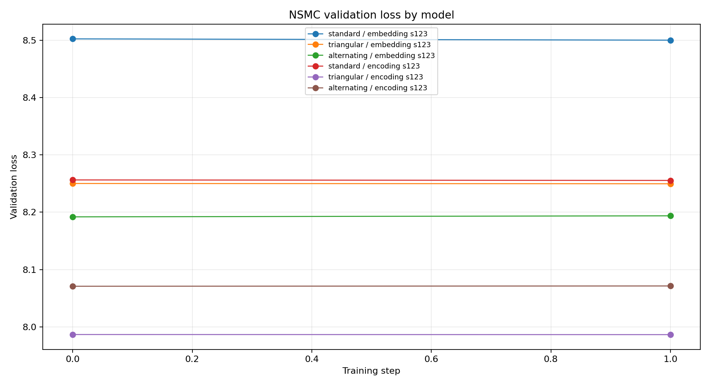
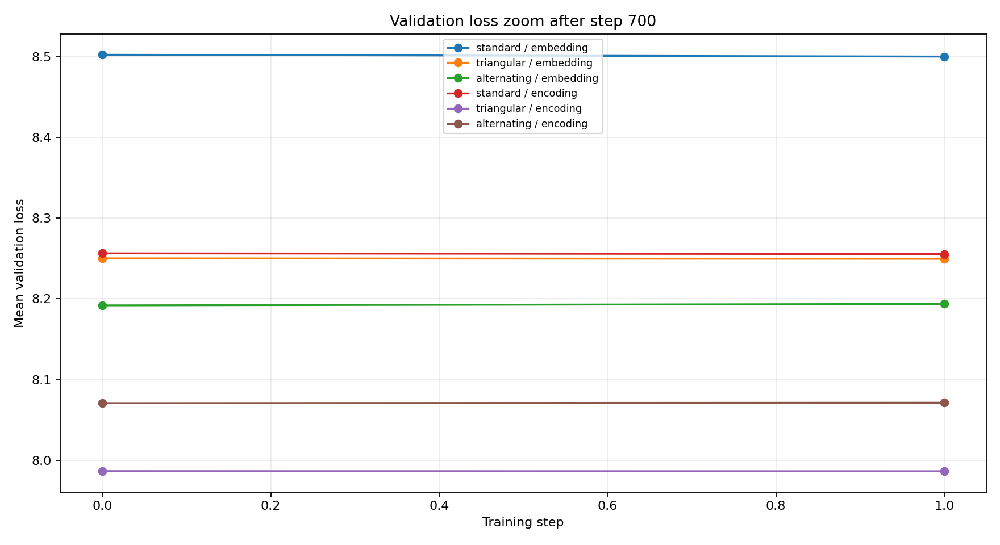
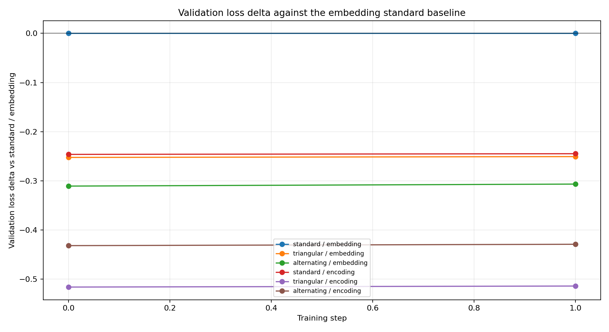
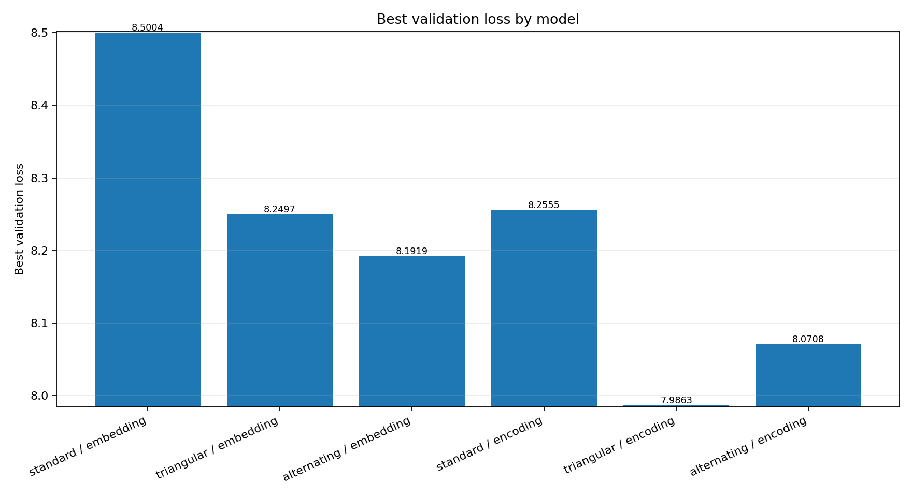
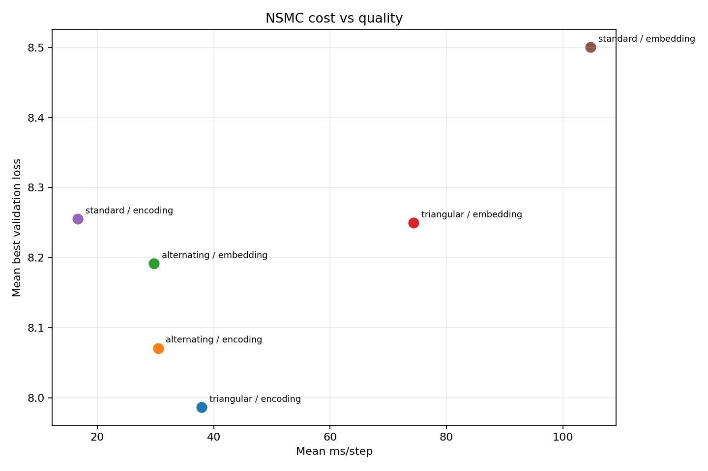
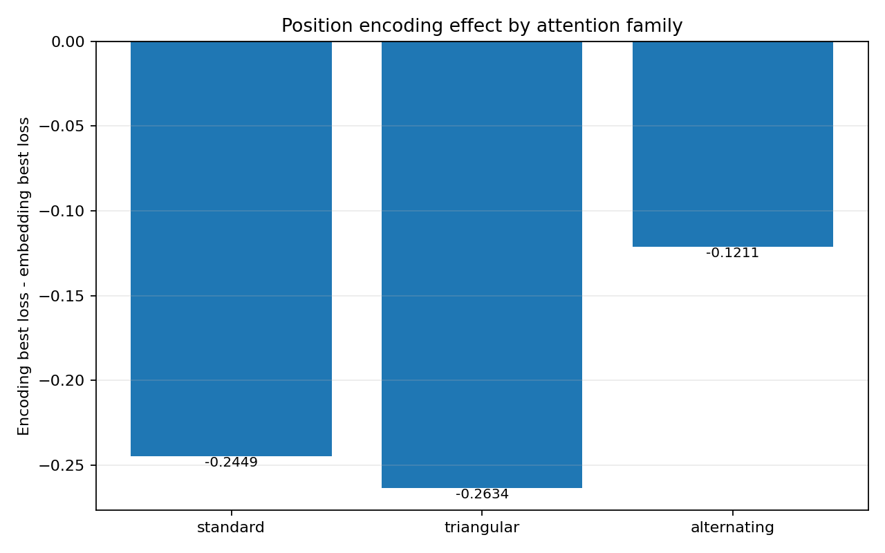
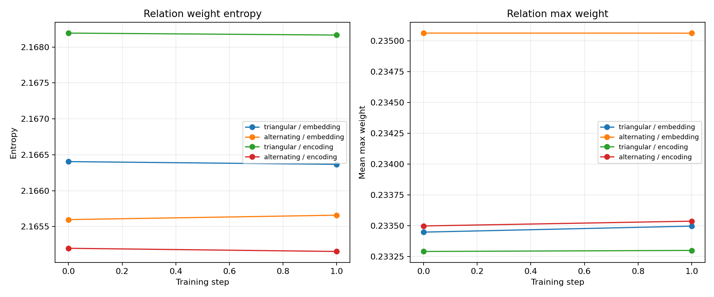

# [삼각 관계] Position Mode NSMC Report

## Background

이번 실험은 위치 정보를 learned position embedding으로 줄 때와 fixed sin/cos positional encoding으로 줄 때를 비교한다. `[삼각 관계]`는 `score[i,j,k]`로 세 토큰 조합을 직접 만들기 때문에, 위치 신호가 hidden state에 섞이는 방식의 영향을 standard attention보다 크게 받을 수 있다는 가설을 둔다.

비교 대상은 standard, `[삼각 관계]`, alternating을 각각 embedding/encoding 위치 방식으로 만든 정확히 6개 모델이다.

## Setup

- device: `mps`
- variants: `standard_embedding,triangular_embedding,alternating_embedding,standard_encoding,triangular_encoding,alternating_encoding`
- seeds: `123`
- steps: `1`
- eval_every: `1`
- context_length: `8`
- batch_size: `2`
- top_k: `4`
- triangular final: `pair_gated + learned logit scale + topk`
- alternating order: `standard -> triangular`

## Raw Results

| variant | attention | position | seed | params | final val | best val | ms/step | entropy |
| --- | --- | --- | ---: | ---: | ---: | ---: | ---: | ---: |
| standard_embedding | standard | embedding | 123 | 487224 | 8.5004 | 8.5004 | 104.78 | - |
| triangular_embedding | triangular | embedding | 123 | 511810 | 8.2497 | 8.2497 | 74.34 | 2.166 |
| alternating_embedding | alternating | embedding | 123 | 499517 | 8.1937 | 8.1919 | 29.74 | 2.166 |
| standard_encoding | standard | encoding | 123 | 486712 | 8.2555 | 8.2555 | 16.65 | - |
| triangular_encoding | triangular | encoding | 123 | 511298 | 7.9863 | 7.9863 | 37.92 | 2.168 |
| alternating_encoding | alternating | encoding | 123 | 499005 | 8.0713 | 8.0708 | 30.45 | 2.165 |

## Summary

| variant | attention | position | best val | final val | ms/step | params | score elements/model |
| --- | --- | --- | ---: | ---: | ---: | ---: | ---: |
| standard_embedding | standard | embedding | 8.5004 | 8.5004 | 104.78 | 487224 | 1024 |
| triangular_embedding | triangular | embedding | 8.2497 | 8.2497 | 74.34 | 511810 | 2048 |
| alternating_embedding | alternating | embedding | 8.1919 | 8.1937 | 29.74 | 499517 | 1536 |
| standard_encoding | standard | encoding | 8.2555 | 8.2555 | 16.65 | 486712 | 1024 |
| triangular_encoding | triangular | encoding | 7.9863 | 7.9863 | 37.92 | 511298 | 2048 |
| alternating_encoding | alternating | encoding | 8.0708 | 8.0713 | 30.45 | 499005 | 1536 |

## Position Effect

`encoding - embedding`이 음수이면 fixed positional encoding이 더 낮은 best validation loss를 냈다는 뜻이다.

| attention family | embedding best | encoding best | encoding - embedding | winner |
| --- | ---: | ---: | ---: | --- |
| standard | 8.5004 | 8.2555 | -0.2449 | encoding better |
| triangular | 8.2497 | 7.9863 | -0.2634 | encoding better |
| alternating | 8.1919 | 8.0708 | -0.1211 | encoding better |

## Figures

- Full loss curves: `reports/smoke_position_mode_filename_loss_full.png`
- Zoom loss curves after 700: `reports/smoke_position_mode_filename_loss_zoom_700.png`
- Delta loss curves: `reports/smoke_position_mode_filename_loss_delta.png`
- Best loss bar: `reports/smoke_position_mode_filename_best_loss_bar.png`
- Cost-quality scatter: `reports/smoke_position_mode_filename_cost_quality.png`
- Position effect: `reports/smoke_position_mode_filename_position_effect.png`
- Relation stats: `reports/smoke_position_mode_filename_relation_stats.png`
- History CSV: `reports/smoke_position_mode_filename_history.csv`
- Summary CSV: `reports/smoke_position_mode_filename_summary.csv`

## Interpretation

- best validation loss 기준 최상위 모델은 `triangular_encoding`이다.
- `standard` 계열의 encoding-embedding best loss 차이는 `-0.2449`이다.
- 핵심 가설과 맞게 `[삼각 관계]`는 fixed encoding에서 best loss가 `0.2634` 낮았다.
- `alternating` 계열의 encoding-embedding best loss 차이는 `-0.1211`이다.
- 위치 encoding 효과는 standard보다 `[삼각 관계]`에서 더 우호적으로 나타났다.

확대 그래프는 700 step 이후의 후반 학습 구간에서 여섯 곡선이 실제로 벌어지는지 확인하기 위한 것이다. delta 그래프는 `standard_embedding`을 기준으로 각 모델의 상대적 손익을 보여주며, position-effect 그래프는 같은 attention family 안에서 위치 방식만 바꾼 차이를 압축해서 보여준다.

## Next Direction

- encoding이 `[삼각 관계]`에서만 유리하면, 삼각 relation score에 relative position bias 또는 RoPE 계열을 추가하는 후속 실험을 진행한다.
- 모든 attention family에서 encoding이 비슷하게 유리하면, 위치 방식은 모델별 특성이 아니라 작은 모델/NSMC 설정의 일반 안정화 효과로 해석한다.
- encoding 이득이 없으면, `[삼각 관계]`의 병목은 위치 신호보다 top-k 후보 품질, pair-value gate, 또는 relation softmax 온도 쪽으로 본다.
