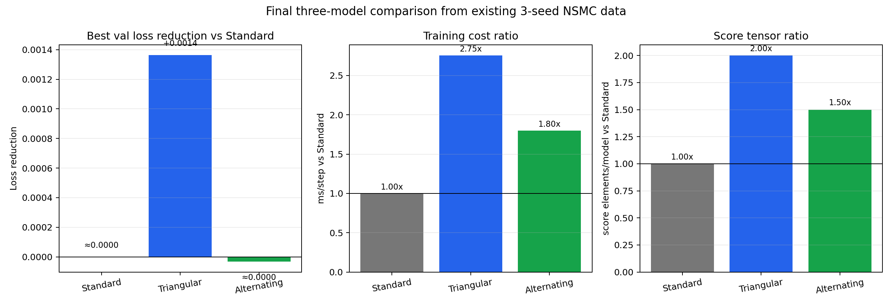

# [삼각 관계] Final Three-Model Report

## 비교 방식

실험을 다시 돌리지 않고, 기존 `seeds=123,456,789` NSMC 결과를 모델별 대표값으로 집계했다. seed별 raw row는 최종 해석에서 제외하고, 아래 세 모델만 비교한다.

- `standard`: 기존 일반 self-attention
- `triangular_final`: 최종 [삼각 관계], `pair_gated + learned scale + top_k=8`
- `alternating_standard_triangular`: `standard -> triangular` 순서로 번갈아 쓰는 혼합 모델

## 최종 비교

| model | best val loss | loss reduction vs standard | ms/step | cost ratio | score tensor ratio |
| --- | ---: | ---: | ---: | ---: | ---: |
| `standard` | 7.3112 | baseline | 8.10 | 1.00x | 1.00x |
| `triangular_final` | 7.3099 | +0.0014 | 22.30 | 2.75x | 2.00x |
| `alternating_standard_triangular` | 7.3113 | ≈0.0000 | 14.57 | 1.80x | 1.50x |

## 해석

- 성능만 보면 `triangular_final`이 가장 좋다. 3개 seed 평균 best val loss가 standard보다 `0.0014` 낮다.
- 비용까지 보면 차이가 선명하다. `triangular_final`은 score tensor가 standard의 `2.00x`, step time은 `2.75x`다.
- 혼합 모델은 기대했던 절충점이 되지 못했다. 비용은 standard보다 `1.80x`로 늘었지만, best val loss는 standard와 사실상 동률이고 `triangular_final`보다 낮지 않다.
- 따라서 이번 최종 비교의 결론은 “일반 attention과 섞기보다, 최종 [삼각 관계]를 명확히 쓰는 쪽이 성능상 이득을 냈다”이다.

## 결론

최종 [삼각 관계]는 NSMC LM에서 작지만 일관된 loss 개선을 냈다. 다만 개선폭은 비용 증가에 비해 작으므로, 다음 연구 가치는 성능 구조를 더 키우는 것보다 `top-k` 후보 선택과 gather path를 최적화해 비용을 줄이는 데 있다.

## 산출물

- Compact CSV: `reports/final_three_model_comparison.csv`
- Compact plot: `reports/final_three_model_comparison.png`
- Raw JSON: `reports/final_triangular_nsmc_comparison.json`
- Raw CSV: `reports/final_triangular_nsmc_comparison.csv`
- Original summary CSV: `reports/final_triangular_nsmc_summary.csv`
