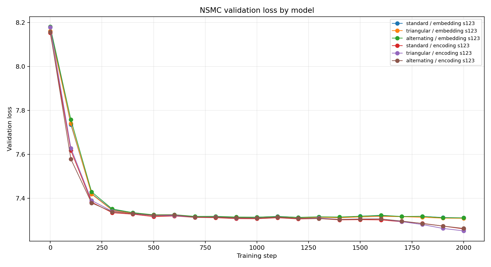
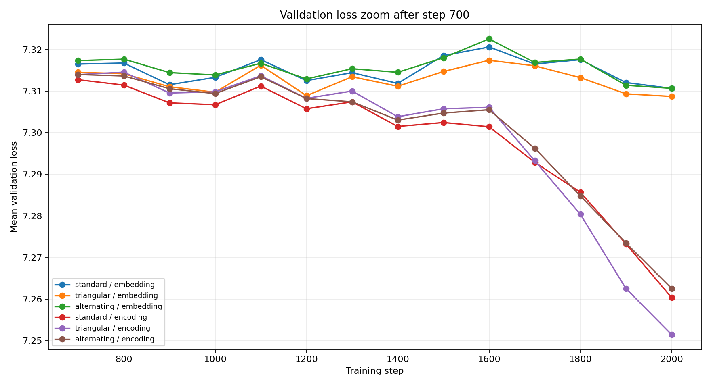
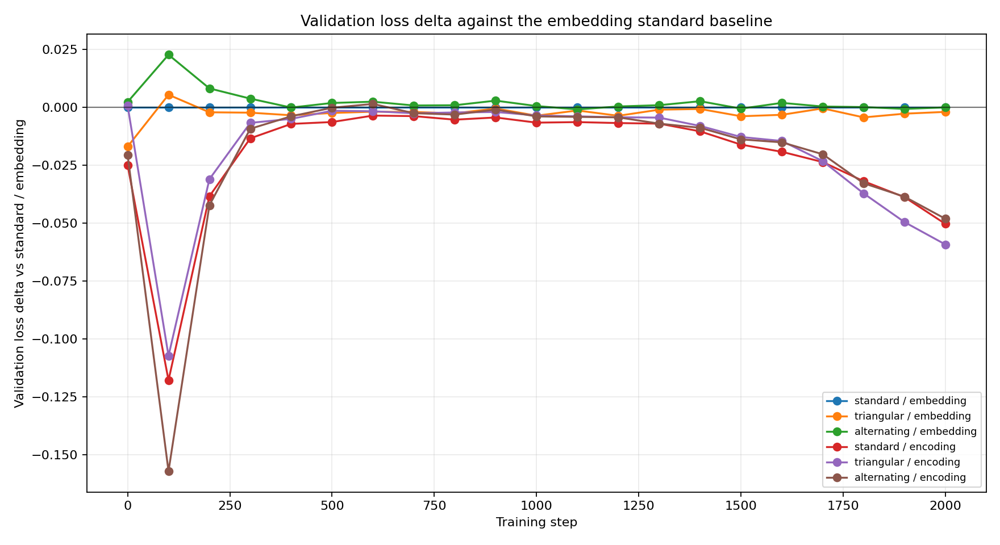
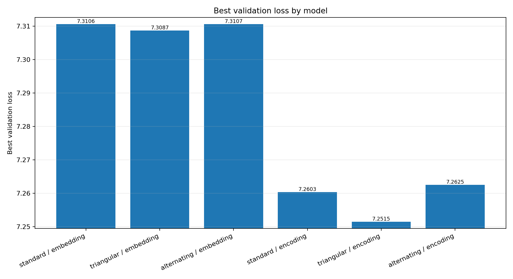
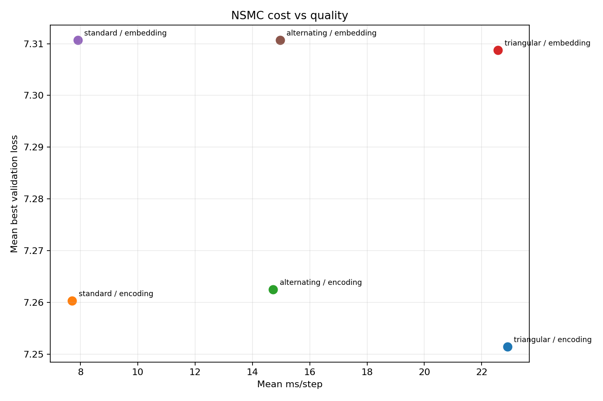
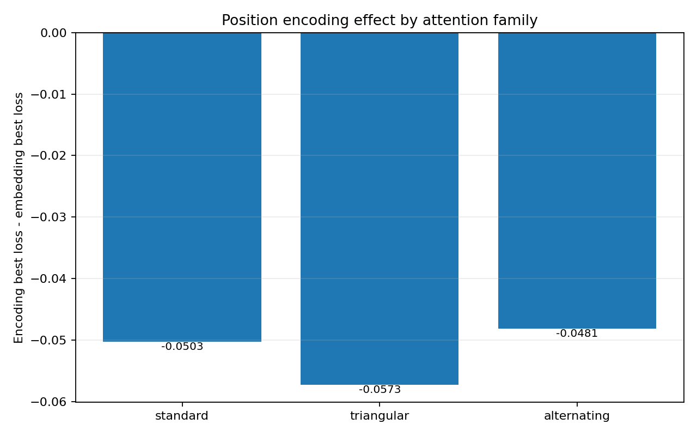
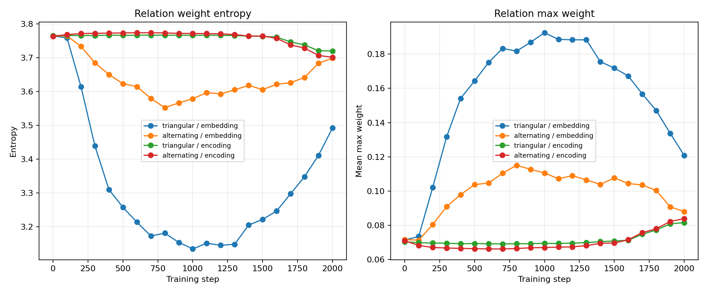

# [삼각 관계] Position Mode NSMC Report

## Background

이번 실험은 위치 정보를 learned position embedding으로 줄 때와 fixed sin/cos positional encoding으로 줄 때를 비교한다. `[삼각 관계]`는 `score[i,j,k]`로 세 토큰 조합을 직접 만들기 때문에, 위치 신호가 hidden state에 섞이는 방식의 영향을 standard attention보다 크게 받을 수 있다는 가설을 둔다.

비교 대상은 standard, `[삼각 관계]`, alternating을 각각 embedding/encoding 위치 방식으로 만든 정확히 6개 모델이다.

## Setup

- device: `mps`
- variants: `standard_embedding,triangular_embedding,alternating_embedding,standard_encoding,triangular_encoding,alternating_encoding`
- seeds: `123`
- steps: `2000`
- eval_every: `100`
- context_length: `32`
- batch_size: `8`
- top_k: `8`
- triangular final: `pair_gated + learned logit scale + topk`
- alternating order: `standard -> triangular`

## Raw Results

| variant | attention | position | seed | params | final val | best val | ms/step | entropy |
| --- | --- | --- | ---: | ---: | ---: | ---: | ---: | ---: |
| standard_embedding | standard | embedding | 123 | 488760 | 7.3106 | 7.3106 | 7.91 | - |
| triangular_embedding | triangular | embedding | 123 | 513346 | 7.3087 | 7.3087 | 22.57 | 3.492 |
| alternating_embedding | alternating | embedding | 123 | 501053 | 7.3107 | 7.3107 | 14.97 | 3.698 |
| standard_encoding | standard | encoding | 123 | 486712 | 7.2603 | 7.2603 | 7.71 | - |
| triangular_encoding | triangular | encoding | 123 | 511298 | 7.2515 | 7.2515 | 22.90 | 3.720 |
| alternating_encoding | alternating | encoding | 123 | 499005 | 7.2625 | 7.2625 | 14.72 | 3.701 |

## Summary

| variant | attention | position | best val | final val | ms/step | params | score elements/model |
| --- | --- | --- | ---: | ---: | ---: | ---: | ---: |
| standard_embedding | standard | embedding | 7.3106 | 7.3106 | 7.91 | 488760 | 65536 |
| triangular_embedding | triangular | embedding | 7.3087 | 7.3087 | 22.57 | 513346 | 131072 |
| alternating_embedding | alternating | embedding | 7.3107 | 7.3107 | 14.97 | 501053 | 98304 |
| standard_encoding | standard | encoding | 7.2603 | 7.2603 | 7.71 | 486712 | 65536 |
| triangular_encoding | triangular | encoding | 7.2515 | 7.2515 | 22.90 | 511298 | 131072 |
| alternating_encoding | alternating | encoding | 7.2625 | 7.2625 | 14.72 | 499005 | 98304 |

## Position Effect

`encoding - embedding`이 음수이면 fixed positional encoding이 더 낮은 best validation loss를 냈다는 뜻이다.

| attention family | embedding best | encoding best | encoding - embedding | winner |
| --- | ---: | ---: | ---: | --- |
| standard | 7.3106 | 7.2603 | -0.0503 | encoding better |
| triangular | 7.3087 | 7.2515 | -0.0573 | encoding better |
| alternating | 7.3107 | 7.2625 | -0.0481 | encoding better |

## Figures

- Full loss curves: `reports/position_mode_6model_loss_full.png`
- Zoom loss curves after 700: `reports/position_mode_6model_loss_zoom_700.png`
- Delta loss curves: `reports/position_mode_6model_loss_delta.png`
- Best loss bar: `reports/position_mode_6model_best_loss_bar.png`
- Cost-quality scatter: `reports/position_mode_6model_cost_quality.png`
- Position effect: `reports/position_mode_6model_position_effect.png`
- Relation stats: `reports/position_mode_6model_relation_stats.png`
- History CSV: `reports/position_mode_6model_history.csv`
- Summary CSV: `reports/position_mode_6model_summary.csv`

## Interpretation

- best validation loss 기준 최상위 모델은 `triangular_encoding`이다.
- encoding variant는 learned position table을 학습하지 않아 같은 attention family에서 parameter가 `2048`개 적다.
- `standard` 계열의 encoding-embedding best loss 차이는 `-0.0503`이다.
- 핵심 가설과 맞게 `[삼각 관계]`는 fixed encoding에서 best loss가 `0.0573` 낮았다.
- `alternating` 계열의 encoding-embedding best loss 차이는 `-0.0481`이다.
- 위치 encoding 효과는 standard보다 `[삼각 관계]`에서 더 우호적으로 나타났다.
- 공식 비교는 seed 123 단일 실행이므로, 효과 방향은 강하게 보이지만 통계적 확정은 추가 seed 반복이 필요하다.

확대 그래프는 700 step 이후의 후반 학습 구간에서 여섯 곡선이 실제로 벌어지는지 확인하기 위한 것이다. delta 그래프는 `standard_embedding`을 기준으로 각 모델의 상대적 손익을 보여주며, position-effect 그래프는 같은 attention family 안에서 위치 방식만 바꾼 차이를 압축해서 보여준다.

## Next Direction

- 이번처럼 encoding이 전체적으로 유리하고 `[삼각 관계]`에서 폭이 가장 크면, 3 seed 반복으로 방향성을 확인한 뒤 relative position bias 또는 RoPE 계열을 삼각 relation score에 추가한다.
- 모든 attention family에서 encoding 효과가 계속 비슷하게 유지되면, 위치 방식은 모델별 특성이 아니라 작은 모델/NSMC 설정의 일반 안정화 효과로 해석한다.
- encoding 이득이 없으면, `[삼각 관계]`의 병목은 위치 신호보다 top-k 후보 품질, pair-value gate, 또는 relation softmax 온도 쪽으로 본다.
